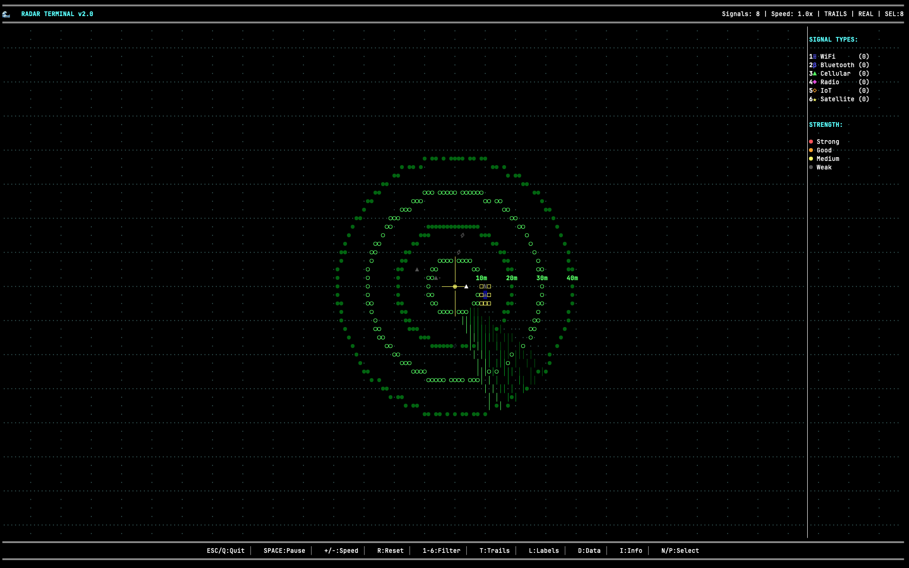

# Radar v2.0

A real-time terminal-based radar system that visualizes network signals and device activity as animated radar sweeps. Monitor WiFi networks, Bluetooth devices, and system connections with professional radar display effects.




## Features

- **Professional Radar Display**: Beautiful terminal-based radar with smooth sweeping animations
- **Real & Simulated Data**: Toggle between actual WiFi/network scanning and simulation
- **Signal Types**: WiFi (≋), Bluetooth (β), Cellular (▲), Radio (◈), IoT (◇), Satellite (★)
- **Interactive Controls**: Filter signals, adjust speed, select for detailed analysis  
- **Authentic Radar Behavior**: Signals appear when swept and persist until next detection cycle
- **Range Rings & Distance Markers**: Professional 10m, 20m, 30m, 40m range indicators
- **Signal Information Panel**: Detailed signal analysis with strength, type, and timing data
- **Cross-Platform**: Works on macOS, Linux, and Windows terminals

## Quick Start

```bash
# Clone and run
git clone https://github.com/e6a5/radar.git
cd radar
go run main.go
```

## Controls

| Key | Action |
|-----|--------|
| `ESC`/`Q` | Quit |
| `SPACE` | Pause/Resume |
| `+`/`-` | Adjust radar speed |
| `R` | Reset radar |
| `S` | Toggle simulation mode |
| `1-6` | Toggle signal types (WiFi, Bluetooth, Cellular, Radio, IoT, Satellite) |
| `T` | Toggle signal trails |
| `L` | Toggle labels |
| `D` | Toggle data mode |
| `N`/`P` | Select signals |
| `I` | Show signal info panel |

## Requirements

- Go 1.23.2 or later
- Terminal with color support

## How It Works

**Real Data Collection** (Default Mode):
- **WiFi Networks**: Scans actual networks with signal strength and human-readable names
- **Network Activity**: Monitors active connections and system processes  
- **Device Discovery**: Finds devices on local network with distance estimation
- **Authentic Radar Physics**: Signals appear when radar beam sweeps over them and persist until next detection cycle

**Visual Features**:
- **Smooth Range Rings**: Professional circular range indicators at 10m intervals
- **Radar Sweep Animation**: Realistic rotating beam with trailing effects
- **Signal Persistence**: Detected signals remain visible until next sweep, just like real radar
- **Real-time Information**: Signal count, speed, and mode displayed in status bar
- **Signal Details Panel**: Select any signal for detailed analysis (strength, distance, bearing, history)

*Press `S` to toggle simulation mode if real data collection is unavailable.*

**Privacy Note**: On first run, you'll be asked for permission to collect device data. Your consent is saved and you won't be prompted again. To revoke consent, delete the file `~/.radar_consent`.

## Building

```bash
# Build binary
go build -o radar main.go

# Run binary
./radar
```

## License

MIT License - see [LICENSE](LICENSE) file for details.

## Contributing

We welcome contributions! See [CONTRIBUTING.md](CONTRIBUTING.md) for guidelines. 